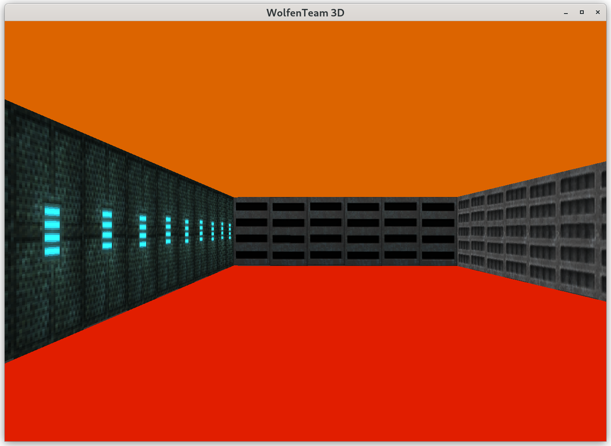

# cub3D
Recreation of Wolfenstein 3D with New Tiles.  
This was a pair project with SimosTigkas.  

So if you want to make a 3D game, one way to do it is to...  
1. Make a 2D map in a text file  
2. Then move within the map  
3. As you move, simulate what you should be seeing from your point of view -> Hence use RAY TRACING.  

**How to Run**:  
./cub3D maps/map_subject.cub  

**Move around in simulator**:  
Use arrow keys:  
1. UP - Move Forward  
2. DOWN - Move Back  
3. Left - Turn Left  
4. Right - Turn Right  

